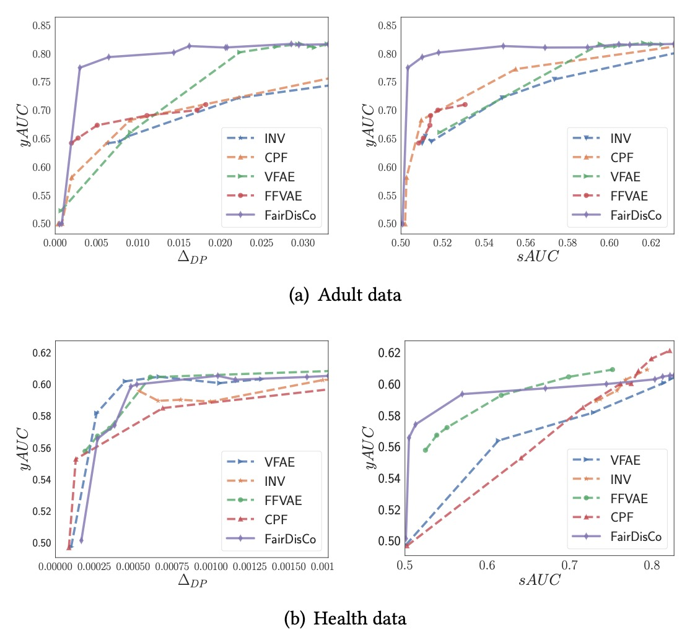
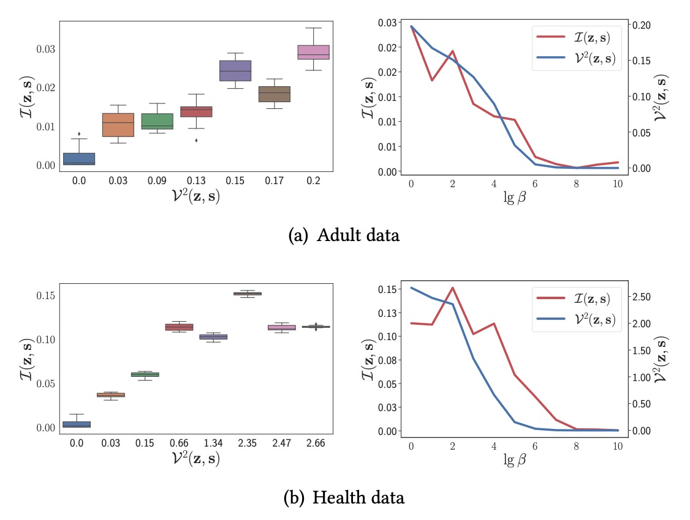
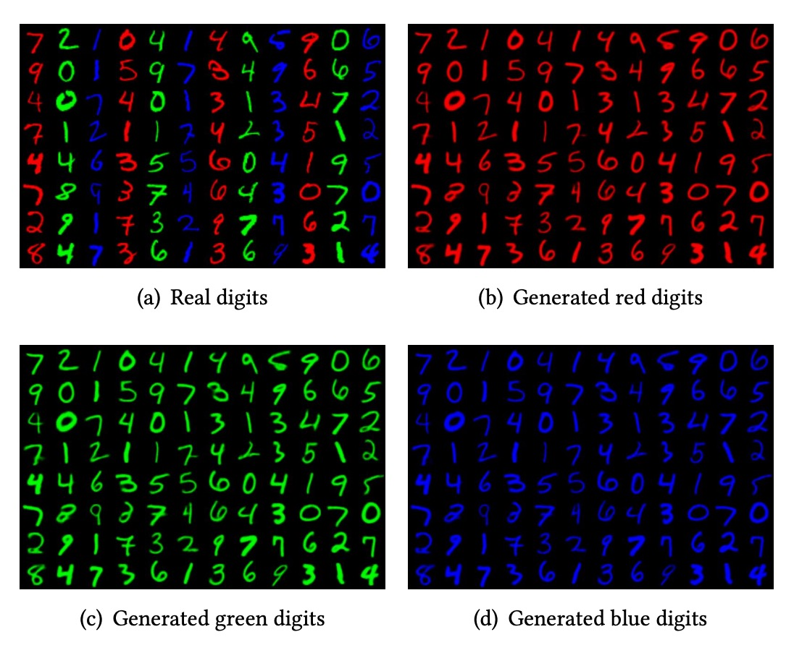
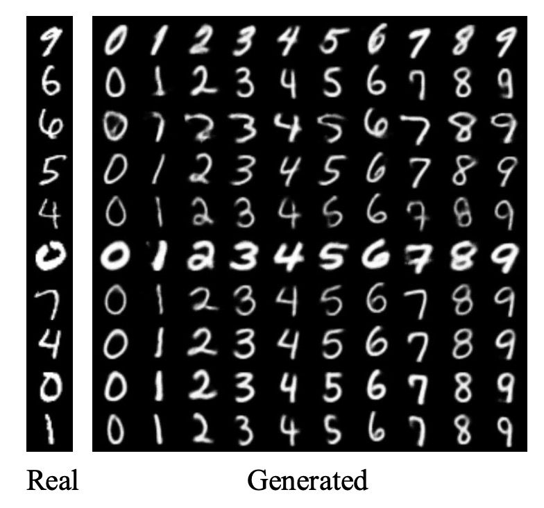

# FairDisCo

implementation of paper **Fair Representation Learning: An Alternative to Mutual Information** (KDD 2022)

## Requirements

* python >= 3.6
* pytorch >= 1.4

## Usage

For dataset Adult-sex with default parameters $lg\beta \in [0,1,2,3,4,5,6,7,8,9]$, use following command

> python FairDisCo.py --cuda 0 --data Adult-sex

For other dataset, you can change the data parameter

> python FairDisCo.py --cuda 0 --data Adult-sex/Adult-race/Health/Bank/German/Creadit/Student/Compas-sex/Compas-race

For dataset MNIST or MNIST-color with default parameters $lg\beta=7$, use following command

> python FairDisCoImage.py --cuda 0 --data color/number

## Repository contents

| file           | description                                                  |
| -------------- | ------------------------------------------------------------ |
| data/       | The datasets dir                                     |
| res/       | The results dir                             |
| FairDisCo.py | The training code of fairdisco                      |
| FairDisCoImage.py    | The training code of fairdisco with image data |
| module.py       | The definition of fairdisco's model structure |
| utils.py       | The data loading function and evaluation function|

## Experimental Result

 

 

 

